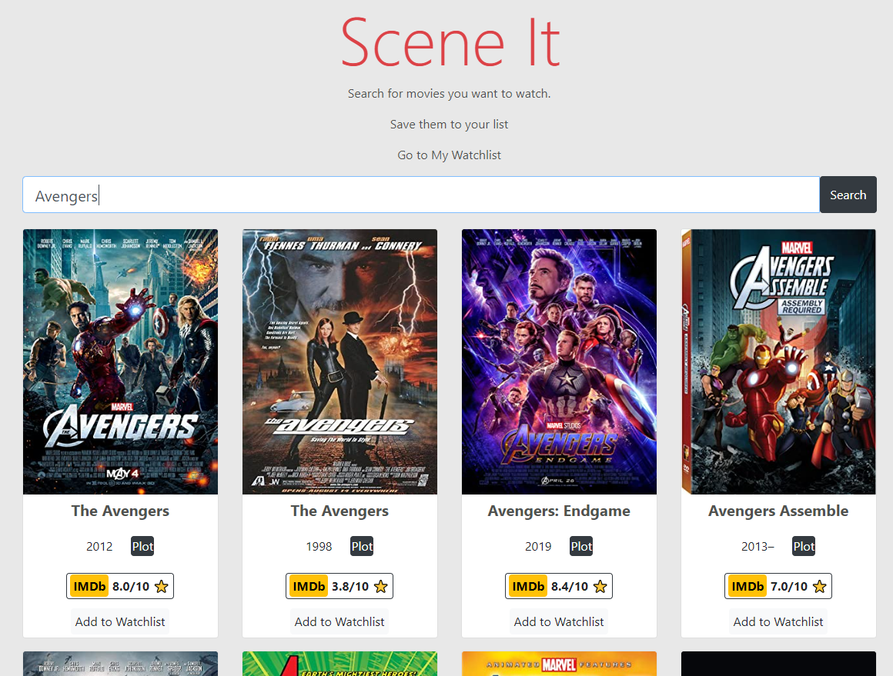

# Scene It

## Contents
- [What It Is](#What-It-Is)
- [What I Used](#What-I-Used)
- [Challenges and Solutions](#Challenges-and-Solutions)
- [Minimum Viable Product](#Minimum-Viable-Product)
- [Stretch Goals](#Stretch-Goals)
- [Screenshots](#Screenshots)
- [Code Examples](#Code-Examples)
## What It Is
Using the OMDb API, Scene It allows a user to search for any movie in the API and save that movie to their personal
watchlist via local storage in the browser. The user is able to switch back and forth between their watchlist and the movie search page. 

I used Axios and Promise Objects to make requests to the OMBb API, render functions with template literals and Bootstrap to format the JSON data coming back from the API, and jQuery to add the formatted data to the DOM.
## What I Used
- JavaScript
- jQuery
- Axios
- Bootstrap
- HTML/CSS
## Challenges and Solutions
- Challenge #1: Requesting and Handling Data from an API

This project was my first experience requesting data from an API, handling the response, and formatting the response data in a way that would be useful and aesthetically pleasing to the user. Because each request to the API is unique to the specific movie the user searches for, I learned to read and understand the API documentation, and write code that would return the specific movie the user searched for. In order to make this work with the OMDb API, I had to pass the movie title along with the API key to the API using the `encodeURIComponent()` JavaScript function. I used the Axios library to make `.get` requests to the API, and used `.then` to handle the Promise Object that was returned from the request.

- Challenge #2: Formatting and Rendering Data to the DOM

The Promise Object from the `.then` method is passed to a render function. The render function uses template literals with inline Bootstrap to style the data. The necessary data for each movie, such as the movie image, title, year of release, and plot are accessed and saved using embedded expressions. The formatted data is then appended to the DOM using jQuery, i.e. `$('.movies-container').html(movieHTML);`.

- Challenge #3: Saving Data To and Loading Data From Local Storage

An additional challenge with this project was learning how to use local storage and understanding how to work with JSON data. I learned about methods such as `JSON.parse` and `JSON.stringify` to convert JSON data into a JavaScript Object that I could work with and then convert back into a JSON string that I could store. I also learned to use local storage methods such as `localStorage.getItem()` and `localStorage.setItem()` to save the user's watchlist data to their browser.

## Minimum Viable Product

For this assignment, the minimum viable product was to build an app that would allow the user to search for a movie by it's title. The response data should then be rendered to the search page and the user should be able to save any movie to their watchlist, which would be placed into local storage.

## Stretch Goals

I wanted to introduce some additional functionality into the app such as the ability to remove movies from the watchlist and prevent duplicate movies from being added to the watchlist. I also added hyperlinks to the result data that would take the user to the Wikipedia page or IMDb page of that particular movie. Finally, I thought it would be a nice feature if the user could give a movie in their watchlist a thumbs up or a thumbs down. This feature is still under construction.

## Screenshots
## Code Examples
